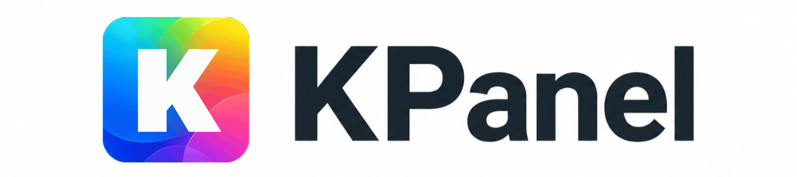
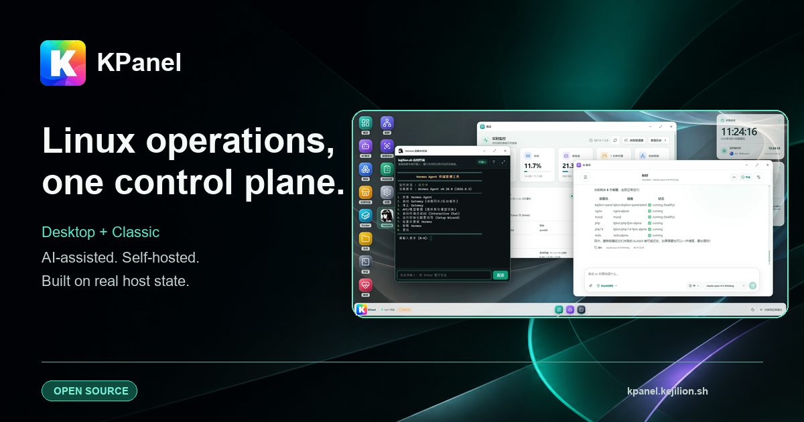
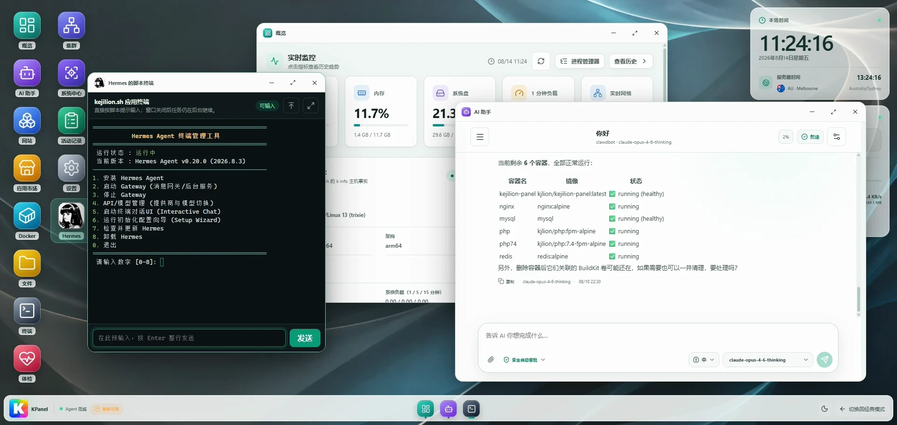
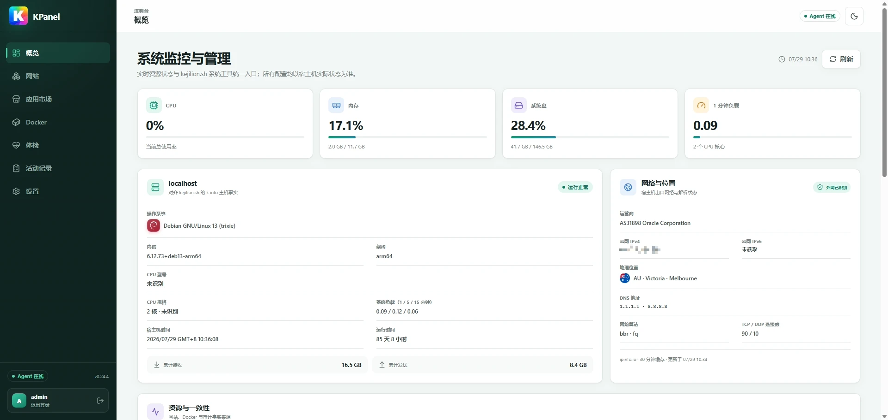
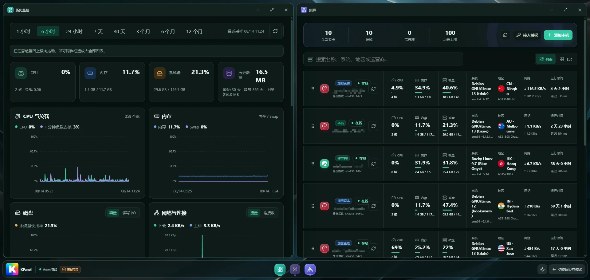

<h1 align="center">
  <a href="https://kpanel.kejilion.sh/">
    
  </a>
</h1>

<p align="center">
  <strong>把服务器，变成你的运维工作台。</strong>
</p>

<p align="center">
  与 <code>kejilion.sh</code> 双向互通的开源 Linux 服务器管理面板。<br>
  桌面模式与经典模式共享同一套主机状态，让系统、网站、Docker、文件、集群与 AI 助手在一个控制面中协同工作。
</p>

<p align="center">
  <a href="https://github.com/kejilion/KPanel/releases/latest"></a>
  <a href="https://github.com/kejilion/KPanel/actions/workflows/ci.yml"></a>
  <a href="https://go.dev/"></a>
  <a href="LICENSE"></a>
</p>

<p align="center">
  <a href="https://kpanel.kejilion.sh/"><strong>产品官网</strong></a> ·
  <a href="https://kpanel.kejilion.sh/en/">English</a> ·
  <a href="#快速开始">开始部署</a> ·
  <a href="https://blog.kejilion.pro/kpanel-kejilion-web-server-panel/">图文教程</a> ·
  <a href="https://github.com/kejilion/KPanel/releases">版本发布</a>
</p>

<p align="center">
  <a href="https://kpanel.kejilion.sh/">
    
  </a>
</p>

KPanel 面向单管理员 Linux 服务器场景：从一台主机开始，在需要时连接更多节点。它不把资源锁进面板私有数据库；
`kejilion.sh`、SSH、Compose 与 KPanel 始终面向同一台主机的真实状态。

<table>
  <tr>
    <td width="50%">
      <strong>一套能力，两种工作方式</strong><br>
      桌面模式适合多窗口协作，经典模式适合快速巡检；切换的是界面，不是系统。
    </td>
    <td width="50%">
      <strong>真实主机，不造第二套事实</strong><br>
      系统、Nginx、Docker 与文件本身就是事实来源，既有资源无需导入即可继续管理。
    </td>
  </tr>
  <tr>
    <td width="50%">
      <strong>AI 是工作窗口</strong><br>
      多 Provider、多模型与结构化工具直接使用 KPanel 已掌握的状态，默认人工确认，高风险操作始终确认。
    </td>
    <td width="50%">
      <strong>从单机到多节点</strong><br>
      KPanel 节点可配对集中观测；非面板主机可通过无需 Docker 的轻量节点，以出站 HTTPS 提供只读观测。
    </td>
  </tr>
</table>

## 一套能力，两种工作方式

桌面模式保留拖拽、最小化、最大化、任务栏与多窗口；经典模式提供熟悉的侧栏、结构化表单和高密度信息。
两者共享同一账户、同一 Agent 与同一主机状态，无需迁移任何资源。

<table>
  <tr>
    <th width="50%">桌面模式 · 把复杂任务摊开来做</th>
    <th width="50%">经典模式 · 保持面板应有的直接</th>
  </tr>
  <tr>
    <td>监控、终端、集群和 AI 助手可以并行展开，适合排障与跨模块操作。</td>
    <td>清晰侧栏、连续配置和快速巡检，保留传统服务器面板的效率。</td>
  </tr>
  <tr>
    <td><a href=".github/assets/readme/kpanel-desktop-workspace.webp"></a></td>
    <td><a href=".github/assets/screenshots/overview.webp"></a></td>
  </tr>
</table>

## AI 是工作窗口，不是第二套控制面

KPanel 的轻量 AI 助手直接理解面板已经掌握的主机与容器状态，通过固定、结构化的 KPanel 工具完成查询、分析和建议，
不提供任意宿主机 Shell 或通用联网工具。

- 支持 OpenAI-compatible、Anthropic 与 Gemini Provider，以及多模型、多会话。
- 会话默认使用人工审批；可选安全自动审批，高风险动作始终需要确认。
- 工具过程、关键变更与结果可审计；主机资源仍由 KPanel Agent 实时读取和统一管理。
- AI 数据独立保存，不会成为 Docker、Nginx、系统配置或文件的第二份事实来源。

## 一屏看全局，也能回到单机细节

<p align="center">
  <a href=".github/assets/readme/kpanel-cluster-monitoring-dark.webp">
    
  </a>
</p>

KPanel 把多节点概览与主机历史趋势放在同一条工作路径中：远端 KPanel 提供只读概要，
本机与新授权 v2 节点支持多主机终端；CPU、内存、磁盘、网络与容器历史可按时间回看。

## 核心能力

| 场景 | KPanel 提供什么 |
| --- | --- |
| **主机与历史监控** | 查看 CPU、内存、磁盘、负载、网络、连接与容器历史；查看实时进程，并管理主机名、SSH、DNS、时区、Swap、软件源、内核预设、系统更新与清理。 |
| **网站与 Nginx** | 发现已有站点、证书与真实 Nginx 配置；管理静态站、PHP 站、反向代理、负载均衡、域名重定向及 LDNMP 环境。 |
| **Docker 与应用** | 管理容器、镜像、网络、卷、日志、性能、更新、备份和迁移；应用市场动态对齐 `app.kejilion.sh`，展示真实安装状态与任务进度。 |
| **文件、终端与体检** | 管理主机文件、实时进程与系统设置；通过受控终端处理本机或已授权 v2 KPanel 节点任务，并运行网络、硬件和综合体检。 |
| **集群与轻量节点** | KPanel 节点可配对集中观测；本机与新授权 v2 节点支持多主机终端。非面板 Linux 主机可使用无需 Docker 的轻量节点，通过出站 HTTPS 提供只读观测。 |
| **AI、任务与审计** | 多 Provider、多模型、多会话的 AI 工作区；固定工具、审批边界、后台任务、资源版本冲突检测、审计与失败恢复。 |

## 快速开始

准备一台 Linux 服务器，使用 `root` 用户执行：

```bash
bash <(curl -sL kejilion.sh) app kpanel
```

安装脚本会检查运行环境、准备所需组件并部署 KPanel。完成后，根据终端提示打开面板并初始化管理员账户。

| 项目 | 当前范围 |
| --- | --- |
| 已实机验证 | Debian 13 · AMD64 |
| 发布架构 | AMD64 · ARM64 |
| 运行基础 | systemd · Docker Engine · Docker Compose v2 |

Debian 12、Ubuntu 22.04/24.04、Rocky/AlmaLinux/CentOS Stream/RHEL/Oracle Linux/Fedora、
Arch/Manjaro 与 openSUSE/SLES 路径已经实现，仍按支持矩阵逐步完成实机准入；
Alpine / OpenRC 暂不属于正式安装范围。准确状态请以[宿主机系统兼容矩阵](docs/platform-support.md)为准。

> [!TIP]
> 初次使用可阅读 [KPanel 官方图文教程](https://blog.kejilion.pro/kpanel-kejilion-web-server-panel/)；
> 需要审查构建产物、固定镜像 digest 或进行开发者部署时，请使用[完整部署文档](docs/deployment.md)。

> [!IMPORTANT]
> KPanel 具备宿主机管理能力。请只在可信服务器上使用官方部署入口；生产环境请先备份现有配置，
> 并为管理入口配置 HTTPS 与访问控制。

## 管理真实主机，边界也必须真实

<p align="center">
  <code>kejilion.sh</code> · <code>SSH</code> · <code>Compose</code> · <code>KPanel</code><br>
  <strong>共同管理同一台 Linux 主机的真实状态</strong>
</p>

- **不接管既有环境**：安装器不会修改 `kejilion.sh`、`/home/web`、Nginx、防火墙或现有站点。
- **来源不限制管理**：脚本、KPanel、Compose 或人工创建的资源，都可以按实际状态继续管理。
- **权限分层**：Web/API 以非特权身份运行；宿主机操作由 Unix Socket 上的结构化 Agent 执行，root PTY 使用独立授权和有界生命周期。
- **入口保护**：登录限速、服务端 Session、CSRF、可选 TOTP、路径约束与供应链校验共同保护管理入口。
- **变更可恢复**：关键操作保留审计记录；配置写入前执行校验，失败时回滚并报告未完成的清理项。

完整原则见 [PROJECT_RULES.md](PROJECT_RULES.md)、[架构与事实来源](docs/architecture.md)、
[生态互通基线](docs/ecosystem-parity.md)与[操作边界审计](docs/operational-boundary-audit.md)。

## 当前边界

Compose / `daemon.json` 通用编辑器、系统重装非交互适配器，以及部分发行版的 DNS / 换源适配器仍在规划中。
这些是待实现能力；后续实现仍需经过鉴权、结构化输入、路径约束、并发控制、审计和失败恢复。

## 文档

| 主题 | 入口 |
| --- | --- |
| 开始使用 | [产品官网](https://kpanel.kejilion.sh/) · [图文教程](https://blog.kejilion.pro/kpanel-kejilion-web-server-panel/) · [部署文档](docs/deployment.md) · [平台支持](docs/platform-support.md) |
| 产品架构 | [架构与事实来源](docs/architecture.md) · [安全模型](docs/security-model.md) · [存储策略](docs/storage-strategy.md) |
| 核心能力 | [AI 工作区](docs/ai-workspace.md) · [集群监控](docs/cluster-monitoring.md) · [Docker 管理](docs/docker-management-v0.18.md) · [应用市场](docs/application-market.md) |
| 生态与质量 | [兼容基线](docs/compatibility.md) · [开发质量标准](docs/development-quality-standard.md) · [项目协作](docs/session-collaboration.md) |
| 版本信息 | [更新记录](CHANGELOG.md) · [最新 Release](https://github.com/kejilion/KPanel/releases/latest) |

<details>
<summary>更多安全、设计与工程文档</summary>

- [两步验证安全契约](docs/two-factor-authentication.md)
- [管理员密码恢复](docs/password-recovery.md)
- [多语言架构与本地化契约](docs/internationalization.md)
- [体检与第三方测试协议](docs/diagnostics.md)
- [网站业务分析](docs/legacy-site-contract.md)
- [多主机终端安全契约](docs/multi-host-terminal.md)

</details>

## 开源许可

KPanel 源代码采用 [GNU Affero General Public License v3.0 only](LICENSE)（SPDX：`AGPL-3.0-only`）。
通过网络向用户提供修改版 KPanel 服务时，应按该协议向这些用户提供对应源码。

Copyright © 2026 kejilion and KPanel contributors.

随 KPanel 分发的 `kejilion.sh` 和其他第三方组件继续使用各自的原始许可，详见[第三方许可声明](THIRD_PARTY_NOTICES.md)。
KPanel 名称和 Logo 的使用边界见[品牌说明](TRADEMARKS.md)。
