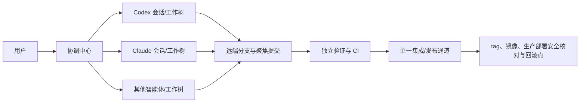

# KPanel 跨智能体协作运行手册

本手册说明 Codex、Claude 及其他智能体如何在同一 KPanel 项目中并行工作。强制规则以
[`project-management.md`](project-management.md) 为准。

## 协作架构



智能体之间不需要读取彼此的私有对话；它们通过 SSH 远端分支、聚焦提交和 CI 交换可验证状态。

## 工具入口

| 工具 | 首个入口 | 专属能力 | 不可作为全局真源的内容 |
| --- | --- | --- | --- |
| Codex | `AGENTS.md` | Codex 任务复用、等待、`.codex-workflows/` | Codex 任务标题、会话 ID、未提交上下文 |
| Claude | `CLAUDE.md` | Claude/Claude Code 会话与本地工具 | Claude 会话历史、Todo、未提交上下文 |
| 其他智能体 | `PROJECT_RULES.md` + 本手册 | 工具自身能力 | 工具私有记忆和聊天记录 |

所有工具共同读取 `PROJECT_RULES.md` 和 `docs/project-management.md`，共同执行仓库的 Make、测试、
CI 和发布入口。规范分层、Definition of Ready/Done、任务契约和交付包只在
`docs/project-management.md` 定义，本手册不维护平行版本。

## 标准协作流程

1. 协调中心执行 `git fetch origin --prune`，盘点远端任务分支、worktree 和活跃任务。
2. 按项目管理规范填写统一任务契约；达到 Definition of Ready 后才分配写任务。
3. 协调中心从最新批准基线创建专用 branch/worktree，并把绝对路径交给唯一写入者。
4. Codex 或 Claude 只在自己的 worktree 写入，阶段结果以聚焦提交保存。
5. 智能体达到 Definition of Done；获得提交/推送授权后形成聚焦提交并通过 SSH 推送同名任务分支，
   再回传标准交付包。未获提交授权时只能保留在专用 worktree，不进入跨工具交接或集成。
6. 另一智能体或独立验证任务从远端提交重建环境并复核，不接管原会话的未提交状态。
7. 协调中心批准后进入集成队列；集成/发布任务只接收精确提交清单，并通过 SSH 更新远端。

## 路径声明与冲突判断

开始任务时声明预计修改的文件或目录：

```text
允许：internal/monitoring/**, web/src/components/monitoring/**
禁止：VERSION, CHANGELOG.md, .github/workflows/**
契约依赖：internal/contract/monitoring.go
```

- 两个任务路径完全分离且无共享契约，可以并行。
- 共享 API、Schema、版本文件、依赖锁文件或同一设计文档时，必须定义先后依赖或由一个任务拥有共享文件。
- `VERSION`、`CHANGELOG.md`、Release workflow 和候选分支在发布冻结后只归发布任务所有。
- 实际需要越出声明范围时，先由协调中心重新确认任务契约和冲突，不得直接扩大范围。

## 上下文与证据效率

- 新任务先通过 `AGENTS.md`/`CLAUDE.md` 和当前产品复核定位业务域，再按 L0-L3 加载相关规范章节；
  只有 L3 或规范架构变更才机械需要完整规范包，普通小改不把长文全量转发给每个会话。
- 协调中心只把目标、任务契约、相关设计/代码、精确基线和已知风险交给执行者，不转发无关长对话。
- 执行者先使用 `rg` 定位受影响实现和测试；已有精确提交证据足够时不重复全仓扫描或相同环境全量测试。
- 验证者从提交差异和失败边界出发，补实现者未覆盖的证据；不以换一个模型重复同一命令冒充独立复核。
- 证据只对精确提交、环境和参数有效。`HEAD`、锁文件、工作流、镜像基础层或实机环境变化时，相关
  结果失效并从受影响层重跑。
- 长期状态只进入 Git、CI、Release、验收记录和必要设计文档；临时推理、会话 ID、模型偏好和工具
  内 Todo 不写入仓库。
- 长时间浏览器 E2E/稳定性测试必须通过 `background-browser-validation` 形成后台 job ID、唯一证据目录、
  硬超时和终态；启动会话不需要前台等待，监控/接手任务只读取同一状态，不重复启动或凭日志增长判成功。
- 可见功能使用 `local-feature-preview` 交付统一回环预览卡；不同会话使用动态端口和独立证据目录，mock、
  本地集成与隔离真机结论不得混写，交接时同时交接 manifest 和停止责任。
- 任何远程操作前使用 `environment-policy.json` 检查用途。`prod-108`/`108` 禁用全部 KPanel 操作；
  测试、只读检查、备份、部署、升级、回滚演练、健康采样、日志读取和清理均不得连接。

## 跨智能体移交模板

```text
任务 scope：<stable-slug>
移交：Codex -> Claude（或 Claude -> Codex）
当前状态：待复核 / 阻塞
基线：<commit>
分支：<branch>
最新提交：<commit>
工作树：clean / dirty（dirty 时列出全部文件）
已完成：
验证命令与结果：
失败或未验证：
允许继续修改：
禁止修改：
建议下一步：
回滚点：
权限：是否允许提交/SSH 推送/更新 main/发布
```

接手者必须先独立执行 `git fetch`、`git status`、`git log` 和差异检查。没有提交的复杂修改默认退回
原智能体完成检查点，不通过复制文件或共享脏工作树交接。

## 能力路由与独立复核

- 按任务所需能力、当前上下文、工具可用性和路径冲突选择智能体，不为模型品牌固定永久角色。
- 协调、分析、开发、验证、集成和发布均可由任一经授权智能体承担，但同一时刻角色和路径所有权唯一。
- L2 优先由不同任务独立复核；L3 的主要实现者与最终验证/发布者必须分离。无法使用另一提供商时，
  使用独立干净会话并记录限制。
- 评审价值来自不同假设、失败边界和证据，不来自模型名称。最终仍以精确差异、测试、实机和 CI 判断。

## 失败处理

- GitHub 插件、Issue、PR、API 或 `gh` 不可访问：不影响 Git 开发；确认 SSH remote 和任务所有权后继续。
- SSH 认证失败：停止远端交付，保留本地提交，修复仓库专用 SSH 凭据后再推送。
- 负责人失联：协调中心确认远端分支、最新提交和工作树后再移交。
- 两个智能体修改同一文件：停止其中一方，分别保存聚焦提交，由集成任务决定顺序和冲突处理。
- 智能体声称完成但无提交或证据：状态保持开发中，不进入集成。
- 未获提交授权但本地差异已完成：保持“待提交授权”，保留专用 worktree，不通过复制文件交接。
- 发布期间出现新功能：进入下一版本任务分支，不修改冻结候选。
